# Práctica 2
## Trabajando con máquinas virtuales y discos
### A. Replicación y traslado de máquinas virtuales

Realicé la exportación de la máquina en formato ova tras apagar la máquina y se me generó un archivo .ova

Al abrir el archivo con Winrar en este caso podemos ver que en el interior están tanto el archivo vmdk como el ovf.

Importo el archivo recién creado y vemos como se genera una nueva máquina con el nombre de la primera más un 1 detrás para diferenciarla.

Procedo a cambiarle el nombre al que se me pide, Linux pr2

Le bajo la memoria ram a 1200 MB.

Y genero una nueva dirección MAC dándole al botón con las flechas azules que aparece en esta imagen.

### B. Instantáneas

Primero instalo el paquete que necesito para usar el nslookup, en este caso según podemos ver con el comando whatprovides es el paquete bind-utils.

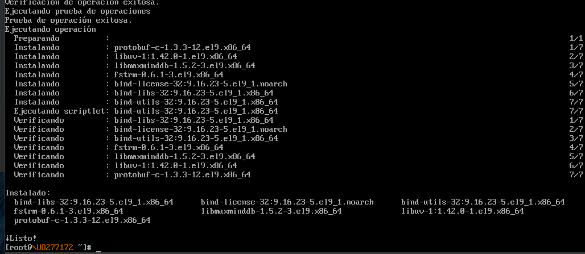

Podemos ver que tras instalar el paquete ya podemos usar el comando nslookup.

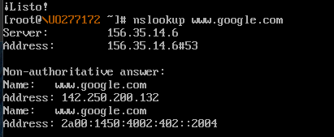

Tras restaurar la instantánea que había creado al iniciar esta máquina e iniciar sesión podemos ver que todo lo que habíamos instalado y hecho se borra, parecido a lo que ocurre cuando retrocedemos a un punto de restauración en windows.

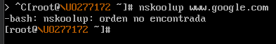

Al borra la máquina junto con todos sus ficheros todas las instantáneas se borran.

### C. Añadir un nuevo disco a las MVs

#### Adición de un segundo disco a un sistema Linux ya instalado

Procedo a crear un nuevo disco duro virtual con un tamaño de 8 GB.

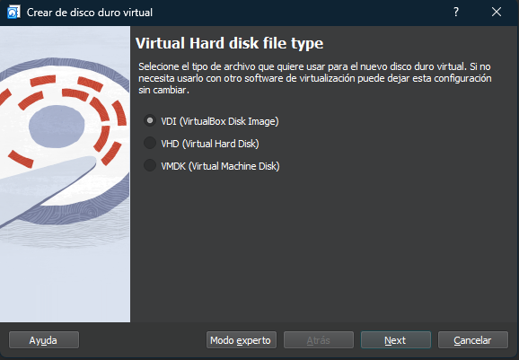

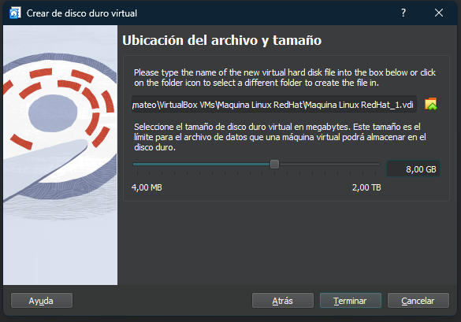

Lo asigno al controlador SATA  de la máquina virtual

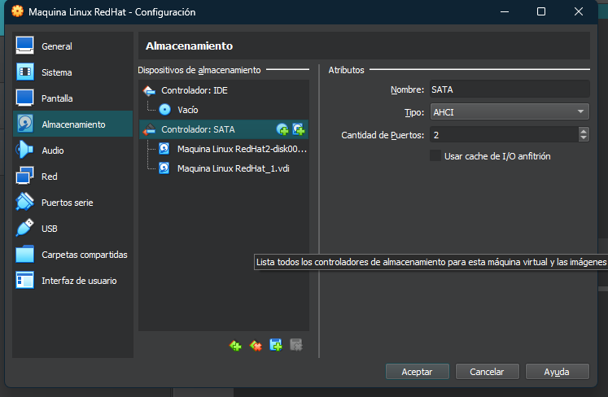

Con el comando parted compruebo las particiones e información del disco, con esto podemos ver que todo lo relacionado con el sistema de arranque y todo esto se encuentra en la ruta /dev/sda por otro lado lo relacionado con el segundo disco añadido será dev/sdb. En linux los nombres de los discos se nombran de esta manera, sda, sdb... mientras que si llevan un numero detrás como sda1 ese número indicaría la partición del disco que se trata.

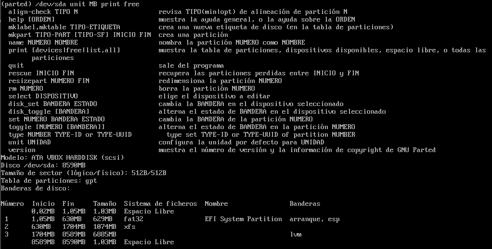

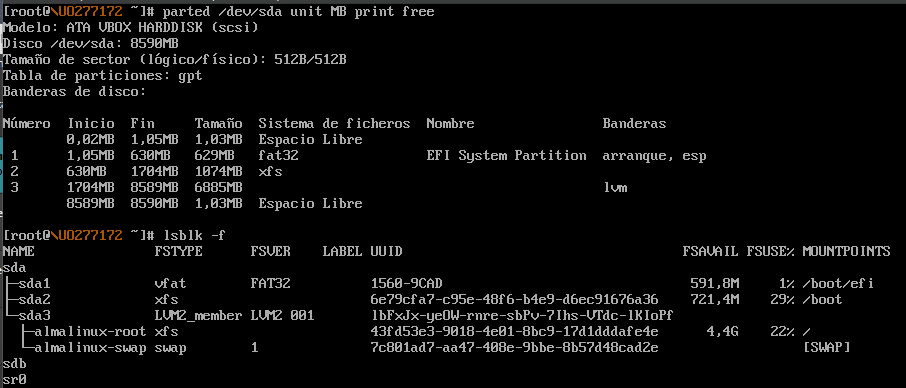

El comando gdisk ya se encontraba instalado, al probar el siguiente comando se me muestra que el disco sdb, el nuevo que hemos instalado, no tiene ninguna partición.

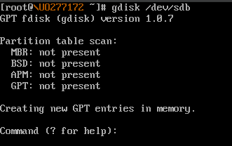

Dentro de gisk ya puedo comenzar a establecer las particiones, primero una de 512 MiB con el formato por defecto Linux filesystem.

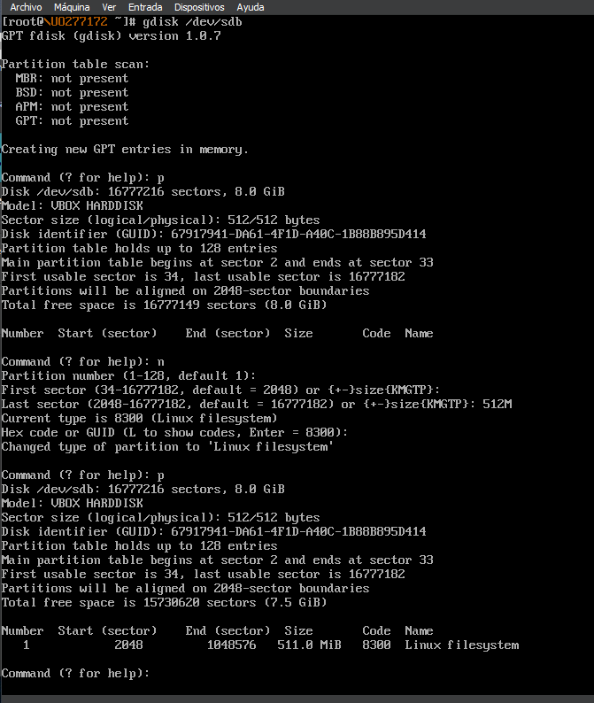

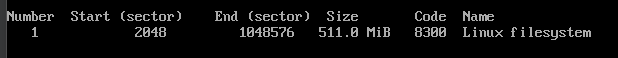

Después creao una de 2.5 GiB con el mismo formato.

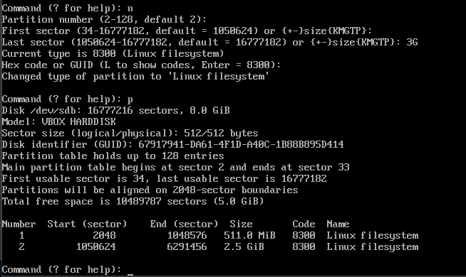

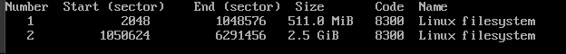

Y por último una partición de 5 GiB pero en este caso con el formato Microsoft basic data. Para poner este formato habrá que introducir el código 0700 en el paso en el que se nos pide código ya que el que se pone por defecto en caso contrario es el Linux filesystem.

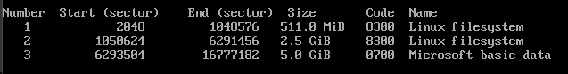

Si utilizo ahora el comando parted con este disco podemos ver las tres particiones que he creado anteriormente podemos ver que las particiones se han guardado correctamente

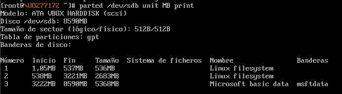

Ahora voy a crear el filesystem para todas las particiones. Para el primer disco utilizo el comando mkfs, después el eZlabel para cambiar el nombre y por último pongo el sistema de archivos a ex3 con el tune3fs.

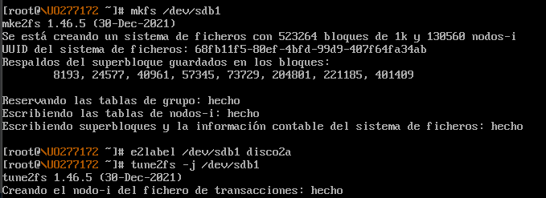

El proceso para crear el sistema de archivos es el mismo en el caso de xfs pero para cambiarle el nombre a la partición deberemos usar xfs_admin como se ve abajo.

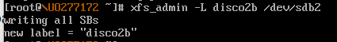

Y de la misma manera para FAT32 pero en este caso usaremos fatlabel para cambiar el nombre.

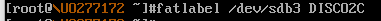

Aquí vemos ya las tres particiones con el formato y el nombre correspondientes.

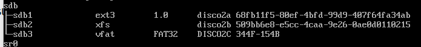

Después he usado el mount de cada una de las particiones para montarlas en el sistema de archivos y aquí podemos ver que he conseguido acceder con el cd perfectamente a la carpeta e incluso crear un archivo de texto de prueba en cada una de ellas.

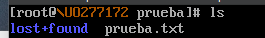

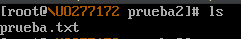

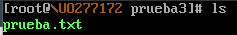

También hago la prueba con el comando lsblk -f para ver que todas las particiones de ambos discos están perfectamente creadas y con los nombres.

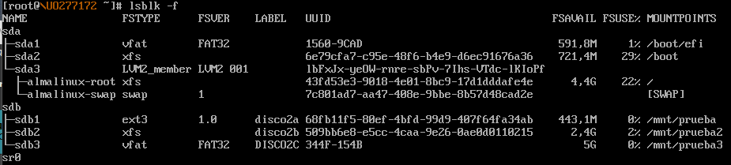

#### Adición de nuevos discos a un sistema Windows ya instalado.

Aquí se puede ver como he instalado ambos discos en el controlador IDE de la máquina Windows.

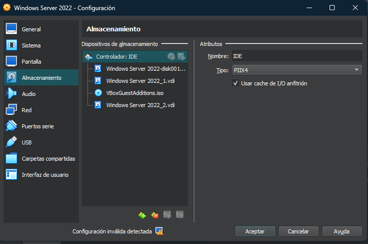

Ambos discos los formateo como GPT desde el administrador de discos de Windows.

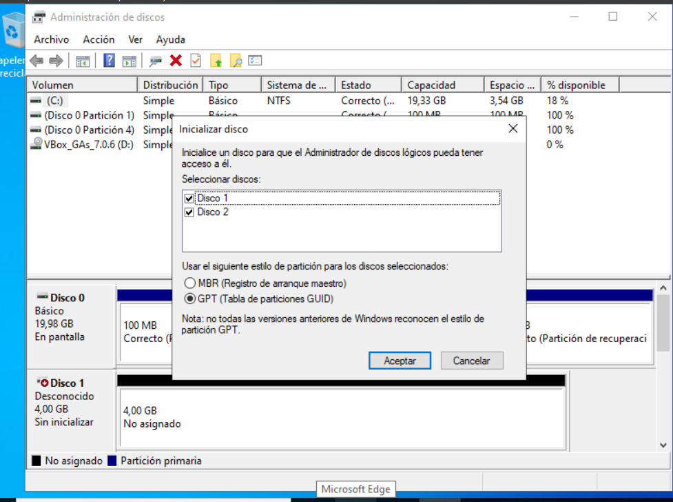

Con el primer disco selecciono la opción de crear volumen simple y después lo inicio como sistema de archivos NTFS.

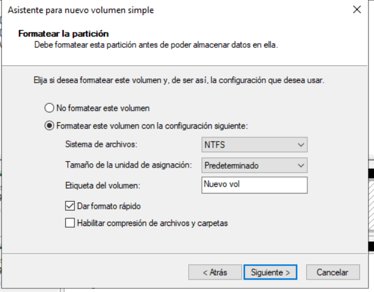

Con el segundo disco he hecho lo mismo que el primero pero creando dos particiones diferentes, es decir partiendo el disco en dos volumenes simples de la mitad del espacio total. Este sería el resultado tras la operación.

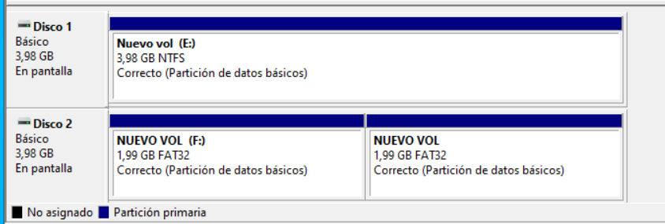

Después como se me dice borro ambas particiones del disco 2 y la única del disco 1 y dejo el espacio como no asignado.

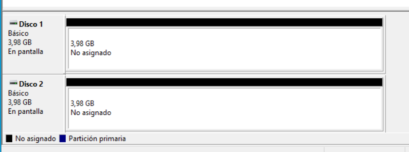

Tras unir los dos discos mediante el NTFS distribuido la nueva unidad tiene el tamaño total unido de ambos discos, 8156 MB

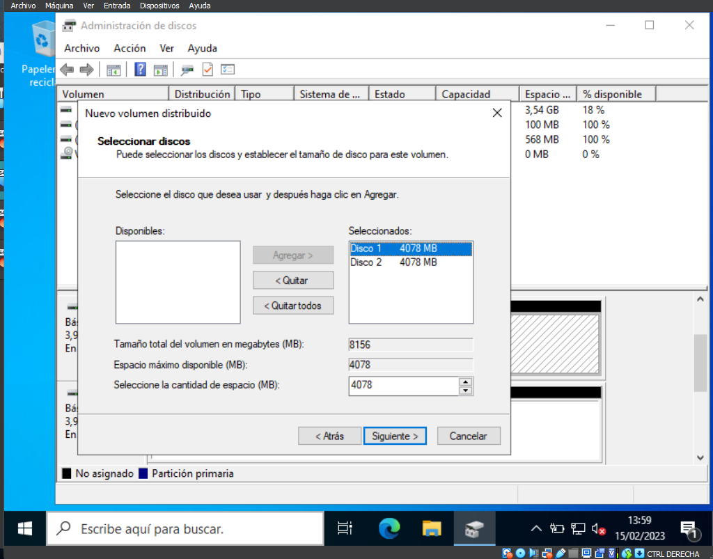

Si borro el volumen distribuido que une ambos discos se borra por completo por lo que la nueva unidad no tiene espacio ya que se borra.

### D. Transvase de discos entre máquias con distintos operativos

Creo un disco en formato NTFS en la máquina Windows para realizar el transvase.

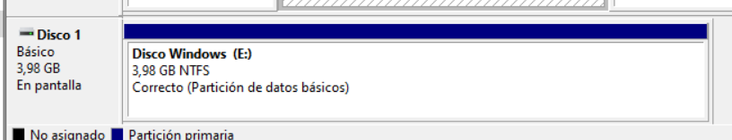

Creo un documento de texto, en este caso llamado Bienvenidos con el texto, "Bienvenido a mi máquina virtual!" en el interior. Este documento será el que abra más adelante en el sistema linux.

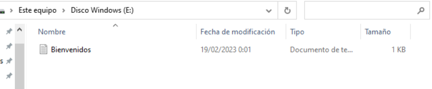

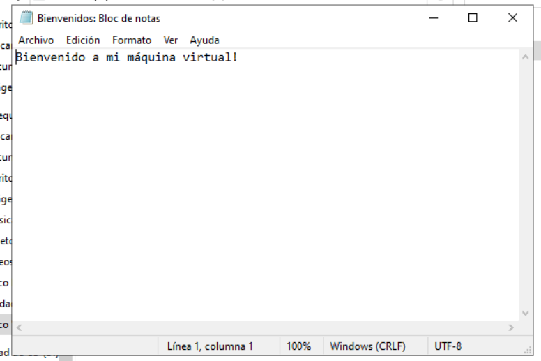

Desinstalo el disco de la máquina Windows y lo instalo en la máquina linux, como se puede ver el disco llamado Windows Server 2022_1

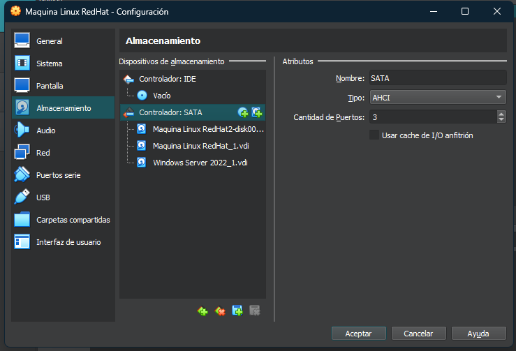

Instalo ambos paquetes, epel-release y ntfs-3g para que mi sistema linux pueda leer los discos con el formato ntfs.

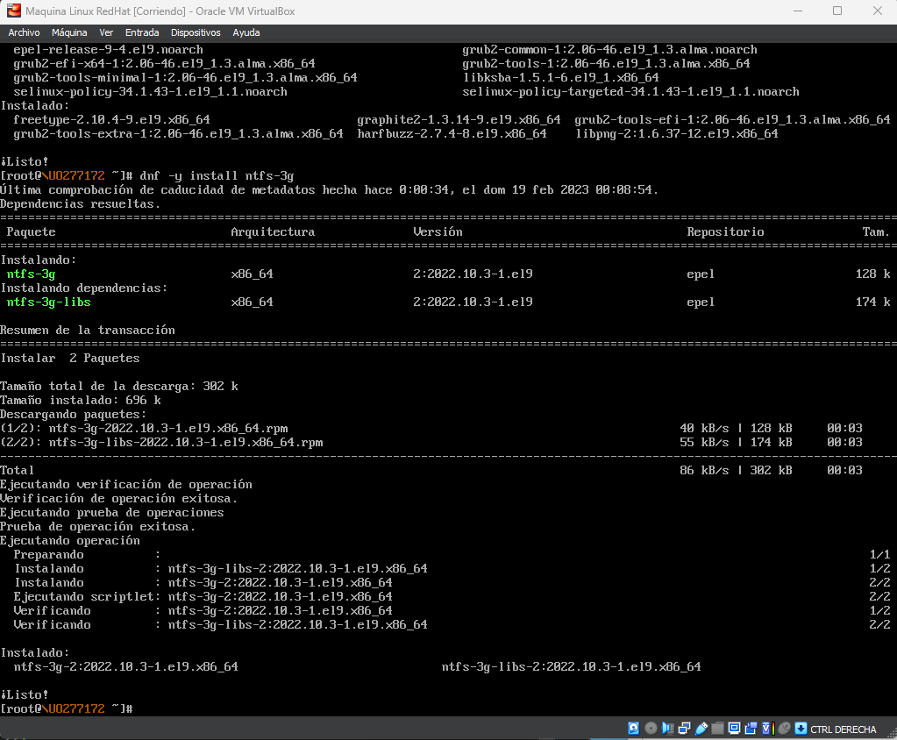

Si probamos el comando lsblk -f podemos ver que el sistema linux ya reconoce el disco.

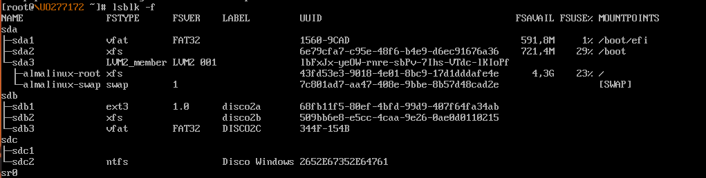

Tras montarlo con el comando mount, en este caso en la carpeta /mnt/prueba podemos ver que el documento de texto llamado Bienvenidos se encuentra en el interior, el documento es el que había creado en la máquina Windows.

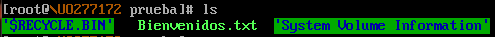

Como podemos ver aquí podemos previsualizar el documento y editarlo con normalidad.

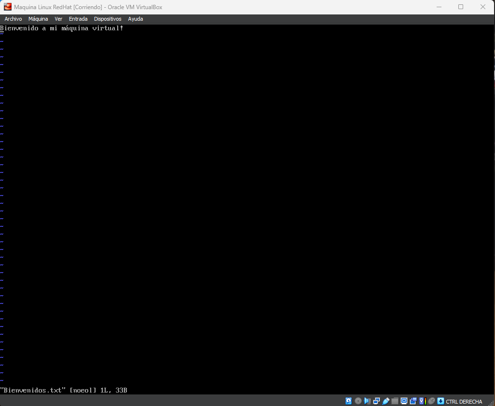

En el disco 1 solo encontramos dos particiones, una que no tiene ninguna clase de formato o nombre y otra que es la del sistema de archivos. La partición 1 no tiene nada en su interior.

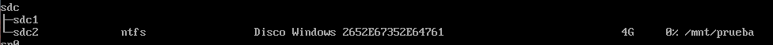
