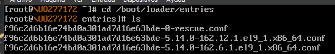
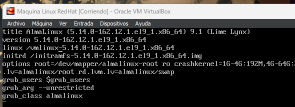
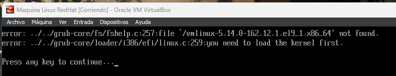
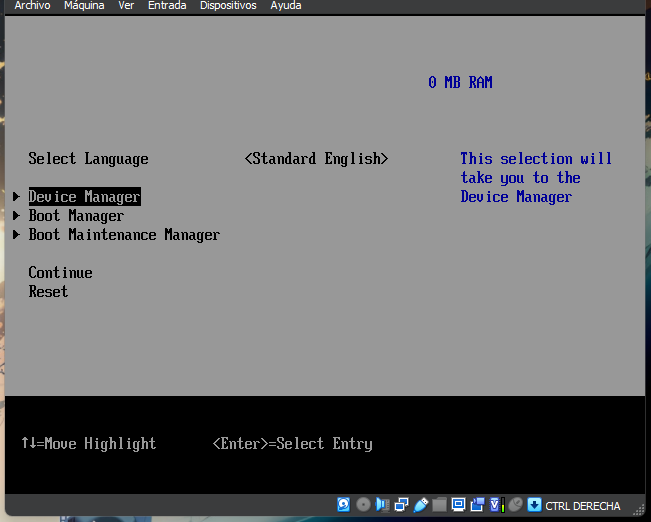
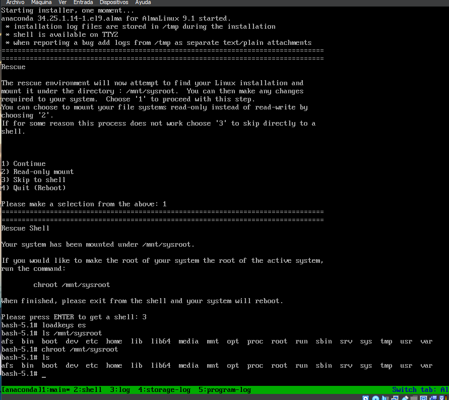
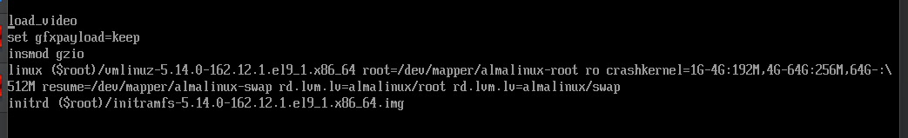

# Práctica 3
```Mateo Rico Iglesias - UO277172```

## Recuperación básica de errores durante el inicio

Primero tenemos aquí el contenido de /boot/loader/entries. Vemos aquí el kernel de recuperación, el de la versión actual del sistema y la anterior versión funcional.



Si entramos al de la última versión y cambiamos el /vmlinuz por /vmlinux al reiniciar y tratar de seleccionar el kernel obtenemos el error ya que no es capaz de encontrarlo.





Para solucionar esto introducimos la iso de instalación, inciamos desde el CD-ROOM y entramos en el modo de troubleshooting




Después uso el procedimiento que aparece el principio de la documentación haciendo chroot a /mnt/sysroot y cambio de nuevo el archivo del kernel.



Si uso el segundo método simplemente pongo la selección encima del kernel en el arranque y toco la tecla 'e'. Esto nos lleva a un documento reducido que contiene las instrucciones para el arranque de ese kernel. En este sitio puedo cambiar el vmlinux por vmlinuz y la máquina inicia con normalidad.

El único problema es que esto solo modifica la configuración para ese arranque, en verdad el arhivo original del kernel no se modifica.



## Instalación de Linux con particionamiento dinámico

### Parte 1

En las siguientes capturas de pantalla se puede ver el proceso que seguí desde que comenzó la instalación de AlmaLinux hasta que ya tenía los discos configurados como se pedía en esta parte de la práctica.


### Parte 2

Primero lo que hago es crear una partición en el tercer disco que ocupe todo el espacio


Después creo en esta misma partición el volúmen físico con ````pvcreate /dev/sdc1````


Con el ````vgextend almalinux /dev/sdc1```` añado al grupo almalinux el volúmen


Para extender el volumen que contiene a home primero desmonto este volumen con ````umount /home```` y tras hacer esto utilizo el ````lvextend -L +4G /dev/almalinux/home```` para extender el volúmen. Tras terminar este proceso utilizo el ````mount /home```` para montar el volúmen de nuevo y ya estoy listo.


Y aquí se puede ver el resultado que obtenemos del comando xfs_growfs al comprobar el volúmen recién modificado.


He ejecutado los comandos que se pedían para que se pueda ver que el disco ha auentado de tamaño, por ejemplo en el lvscan se puede ver bien que ahora es de 10GB t e el pvscan se ve que tiene 4GB libres que son los que acabo de añadir.


